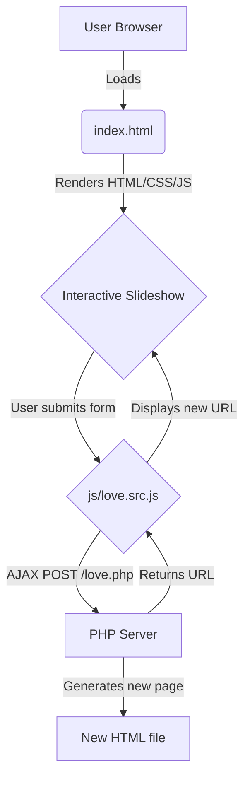

```yaml
Project: valentines_day
Description: A single-page, animated digital love letter and photo slideshow.
Primary Language(s): JavaScript 60% / HTML 30% / PHP 10%
License: Not specified
Entry Points: index.html, index.php
Last Updated: 2025-07-12
```

### 30-Second Summary

This repository contains a single-page web application designed as a Valentine's Day e-card. It presents a story through a sequence of animated text and images, navigated by scrolling. It appears to use a PHP backend to dynamically generate new versions of the page with customized text and music, although the core experience is client-side. It is a self-contained, personal project with no external dependencies besides jQuery and a web server capable of executing PHP.

### Architecture at 10,000 ft


- **User Browser**: The client accessing the site.
- **index.html**: The main static page that contains the entire slideshow structure.
- **Interactive Slideshow**: The UI presented to the user, powered by jQuery and `flowtime.js`.
- **js/love.src.js**: Handles the logic for a form that allows users to create their own version of the page.
- **PHP Server**: A backend process that receives custom text and music choices.
- **New HTML file**: The PHP script generates a new, customized HTML file on the server.

### File/Directory Map
```
.
├── css/            – Contains the single minified stylesheet.
├── fonts/          – Holds the custom Chinese font file.
├── img/            – Contains all images used in the slideshow.
├── js/             – Contains all JavaScript libraries and source code.
│   ├── all.min.js  – A minified combination of libraries like flowtime.js.
│   └── love.src.js – The primary application logic for the page.
├── _config.yml     – Configuration file for GitHub Pages.
├── index.html      – The main entry point and structure for the web app.
├── index.php       – A PHP script for generating custom pages (not present in repo).
└── README.md       – The original project README (in Chinese).
```

### Key Configuration Knobs

To change the text and story of the slideshow, you must edit the content directly within `index.html`.

- **File**: `index.html`
- **Purpose**: Contains all the text and image paths for the story.
- **Example**: To change the opening line:
  ```diff
  - <p class="text1">--❤郭磊一生一世</p>
  + <p class="text1">--❤A New Love Story</p>
  ```

### Quick-Start Commands

This project does not have a package manager or build process.

1.  **Install Dependencies**: None.
2.  **Run in Dev Mode**: Serve the project with a local PHP server.
    ```bash
    php -S localhost:8000
    ```
3.  **Run Tests**: There are no automated tests. Testing must be done manually in a web browser.
4.  **Build for Production**: There is no build step.

### Extension & Customization Guide

- **Adding a New Slide**: Add a new `<div class="ft-page">` element within a `<div class="ft-section">` in `index.html`. Follow the existing numbering convention for `page-X`.
- **Customization**: The core logic in `js/love.src.js` includes a feature to POST to a `love.php` script. This script is missing but is intended to generate new HTML files. To make this work, you would need to create `love.php` to handle the POST request and write a new `.html` file to the server.

### Testing Matrix

- **Unit / Integration / E2E**: None exist. All testing is manual.
- **Linting**: No linting configuration is present.
- **Manual Test Plan**:
  1. Run `php -S localhost:8000`.
  2. Open `http://localhost:8000` in a browser.
  3. Scroll through every slide to ensure images and text appear correctly.
  4. Press the 'Esc' key to check for the final surprise.
  5. Verify the background music plays and the mute button works.

### Deployment Cheat-Sheet

This is a static website. Deploy it by copying the files to any static web host (like GitHub Pages, Netlify, Vercel) that also supports PHP execution if the dynamic generation feature is required.

- **Environment Variables**: None.
- **Build Command**: None. Simply copy the files.

### Gotchas & Known Issues

1.  **Missing `index.php`**: The JavaScript makes an AJAX call to `index.php`, which is not included in the repository. The page generation feature will fail without it.
2.  **Hardcoded URLs**: The music player and analytics scripts use hardcoded HTTP URLs, which may cause mixed-content warnings on HTTPS sites.
3.  **No Dependencies**: The project relies on a CDN for jQuery. If the CDN is down, the site will break.

### License & Attribution Footer

- **License**: No license file is specified in the repository.
- **Third-Party Libraries**:
  - jQuery: MIT License
  - flowtime.js: (License not specified in file)
  - Baidu Analytics / Share: Baidu Commercial License
